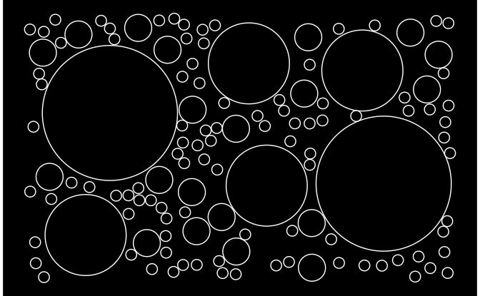
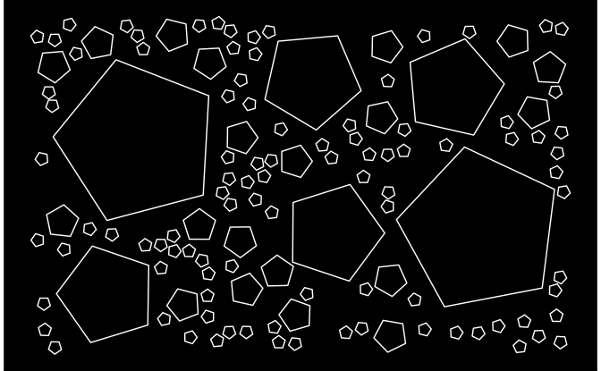
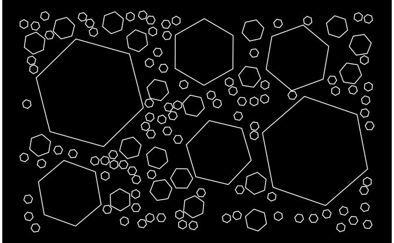

Circle Packing Example
================
Ijeamaka Anyene
1/5/2022

``` r
source(here::here("functions",
                  "pack_circles.R"))
```

``` r
# Packages 
library(dplyr)
library(ggplot2)
library(ggforce)
```

### Background

For the `pack_circles()` function there are three required inputs:

**1: Panel Size**  
This sets the maximum width and height of your plot, and thus is the
limits for where each circle is placed.

``` r
panel_size = list(x = c(0, 8),
                  y = c(0, 5))
```

**2: Config file**  
This is a dataframe containing the predetermined number of circles and
radii for each circle that you want to have “packed”. In my
implementation it always attempts plots one more than the largest
radius. This *could* be fixed in my code, but I have not fixed it and
just always account for it. 🤷

``` r
config = tibble(radius = c(rep(0.1, 100), 
                           rep(0.25, 20),
                           rep(0.75, 5),
                           rep(1.25, 1)))
```

**3: Max attempts**  
This is maximum number of attempts the program will take to pack in a
circle, before it gives up and tries another circle. Be careful with
this parameter, if you make the max attempts large and you are also
packing in a lot of circles into a small panel, it is computationally
taxing.

As I like to say, beauty is pain. Pain is computational art requiring
tons of memory.

### Demo

``` r
set.seed(170)

tictoc::tic()
circle_coords = pack_circles(config,
                             panel_size,
                             max_attempts = 25)
tictoc::toc()
```

    ## 26.847 sec elapsed

You can use `{ggforce}` to quickly plot circles once the algo is
finished running.

``` r
ggplot(data = circle_coords) +
  geom_circle(aes(x0 = x,
                  y0 = y,
                  r = r),
              fill = "black",
              color = "white") +
  coord_equal() +
  theme_void() +
  theme(panel.background = element_rect(fill = "black",
                                        color = "black"))
```



One of the fun things about using ggforce is you can also “pack” shapes
other than circles. For example:

<center>

**Pentagons\!\!**

</center>

``` r
circle_coords %>%
  mutate(angle = runif(nrow(.), 
                       min = 0, 
                       max = 2*pi)) %>%
  ggplot() +
  geom_regon(aes(x0 = x,
                 y0 = y,
                 r = r,
                 sides = 5,
                 angle = angle),
              fill = "black",
              color = "white") +
  coord_equal() +
  theme_void() +
  theme(panel.background = element_rect(fill = "black",
                                        color = "black"))
```



<center>

**Hexagons\!\!**

</center>

``` r
circle_coords %>%
  mutate(angle = runif(nrow(.), 
                       min = 0, 
                       max = 2*pi)) %>%
  ggplot() +
  geom_regon(aes(x0 = x,
                 y0 = y,
                 r = r,
                 sides = 6,
                 angle = angle),
              fill = "black",
              color = "white") +
  coord_equal() +
  theme_void() +
  theme(panel.background = element_rect(fill = "black",
                                        color = "black"))
```



## Next Steps

I may turn this into a package one day. I should also eventually
implement tests. However, my sole use case for this is for generative
art where I personally do not require packages or tests as much.
